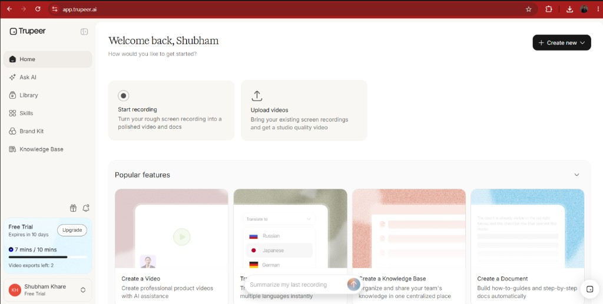
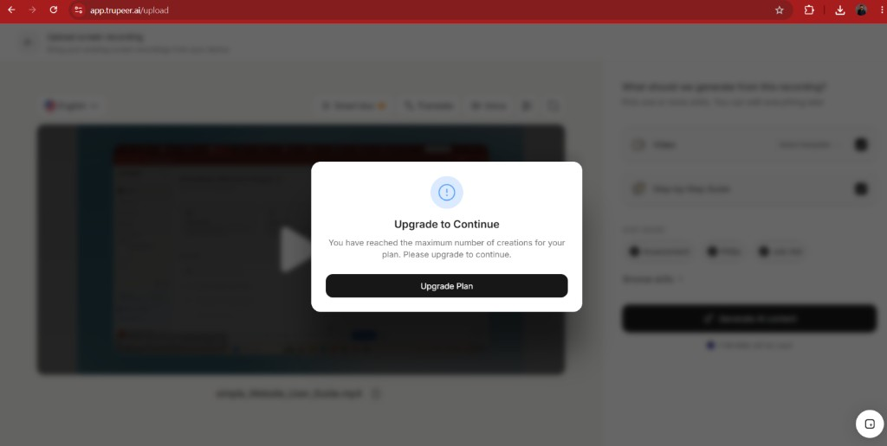
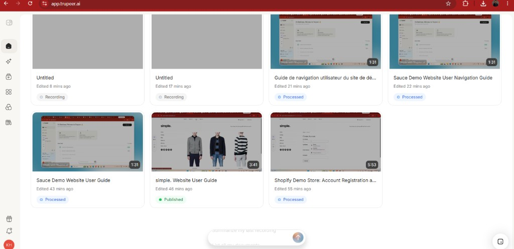
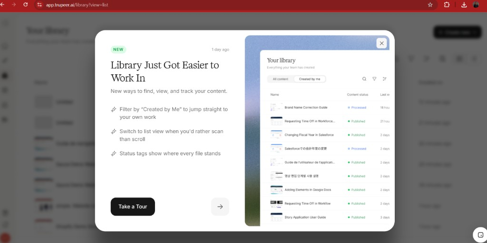
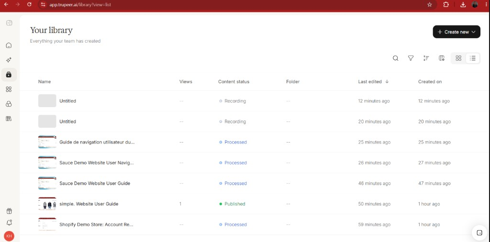

# Trupeer QA Assignment — Part 1: Manual Testing & Bug Report

**Application:** Trupeer (`https://app.trupeer.ai`)  
**Browser:** Chrome  
**Plan under test:** Free Trial (where noted)

---

## Bug #1 — Free Trial usage limits inconsistent with “Upgrade to Continue”

| Field | Detail |
|-------|--------|
| **Title** | Free Trial usage limits are inconsistent with the “Upgrade to Continue” message |
| **Module** | Pricing / Free Trial / Usage Limits |
| **Severity** | S3 – Medium |
| **Priority** | P2 |
| **Environment** | Trupeer · Free Trial · Chrome · `app.trupeer.ai` |

### Preconditions
- User is logged into a Free Trial account.
- Free Trial usage limits are displayed in the left sidebar (e.g. AI video minutes and video exports).

### Steps to Reproduce
1. Log in to Trupeer using a Free Trial account.
2. Navigate to the Home page.
3. Observe the Free Trial usage section in the left sidebar.
4. Verify the displayed limits, for example:
   - AI video: **7 mins / 10 mins**
   - Video exports left: **2** (of 3)
5. Navigate to create/upload a video.
6. Attempt to create another video.
7. Observe the error / upgrade modal.

### Expected Result
The application should allow video creation until the **displayed** Free Trial creation/usage limit is actually reached.

If a limit has been reached, the UI should clearly indicate:
- Which specific limit has been exhausted
- Current usage vs allowed usage
- Remaining available usage (if any)
- The corresponding upgrade / pricing option

### Actual Result
The Free Trial dashboard still shows available usage (e.g. **7 / 10** AI video minutes, **2** video exports left).

When attempting to create/upload another video, the app immediately shows:

> **Upgrade to Continue**  
> You have reached the maximum number of creations for your plan. Please upgrade to continue.

This suggests a separate **creation-count** limit exists, but it is not shown in the Free Trial usage section.

### Impact
Users get conflicting information about Free Trial limits and cannot tell why creation is blocked while the usage panel still shows remaining quota.

### Recommendation
Show the creation limit explicitly in the Free Trial usage section, for example:
- AI Video Minutes: 7 / 10 used
- Video Creations: X / Y used
- Video Exports: 1 / 3 used

The upgrade modal should also name the exact limit that was exhausted.

### Evidence

Free Trial sidebar shows remaining usage, while the create/upload flow blocks with “Upgrade to Continue”.

**Screenshot A — Free Trial usage still available (Home sidebar)**  
Shows **7 mins / 10 mins** AI video usage and **Video exports left: 2**, plus trial expires in 10 days.

**Screenshot B — Creation blocked on `/upload`**  
Modal: **Upgrade to Continue** — “You have reached the maximum number of creations for your plan. Please upgrade to continue.”

---

## Bug #2 — Collapsed left nav does not expand on icon click

| Field | Detail |
|-------|--------|
| **Title** | Left navigation menu does not expand when clicking an option in collapsed mode |
| **Module** | Left Navigation / Sidebar |
| **Severity** | S3 – Medium |
| **Priority** | P2 |
| **Environment** | Trupeer · Chrome · `app.trupeer.ai` |

### Preconditions
- User is logged into the application.
- Left navigation sidebar is in **collapsed** mode (icons only).

### Steps to Reproduce
1. Log in to Trupeer.
2. Collapse the left navigation sidebar.
3. Verify that only navigation icons are visible.
4. Click any navigation menu icon from the collapsed sidebar.
5. Observe the sidebar behavior.

### Expected Result
Clicking a navigation item while the sidebar is collapsed should automatically expand the sidebar and show:
- Menu labels
- The selected menu item
- Any available submenu / options

### Actual Result
Clicking a navigation icon while collapsed does **not** expand the sidebar. Navigation stays collapsed, so the user must expand it manually to see labels.

### Impact
Usability issue: users cannot immediately see which section was selected when working in collapsed mode.

### Recommendation
Implement: **Collapsed sidebar → click icon → sidebar expands → selected item highlighted**.

Optionally, if collapsed navigation is intentional, show a clear tooltip for the selected item on hover/click.

### Evidence

Collapsed left menu; clicking a nav icon (e.g. Library) does not expand the rail to show labels.

**Screenshot — Sidebar remains collapsed after navigating**  
Library is open while the left rail stays icon-only (no menu labels such as Home / Library), so the selected section name is not visible without manually expanding the sidebar.

---

## Bug #3 — “All content” / “Created by me” tabs missing from Library

| Field | Detail |
|-------|--------|
| **Title** | “All content” and “Created by me” filter tabs are missing from the Library UI |
| **Module** | Library |
| **Severity** | S3 – Medium |
| **Priority** | P2 |
| **Environment** | Trupeer · Chrome · Library · List view |

### Steps to Reproduce
1. Log in to Trupeer.
2. Navigate to **Library**.
3. Observe the Library page (list view).
4. Open the **“Library Just Got Easier to Work In”** feature announcement.
5. Compare the UI in the announcement with the actual Library page.

### Expected Result
The Library page should provide the filtering options shown in the feature announcement:
- **All content**
- **Created by me**

These tabs should let users switch between all team content and content created by the current user.

### Actual Result
The actual Library UI does **not** display **All content** or **Created by me**. The announcement shows these tabs as part of the Library experience, but they are absent from the current implementation.

### Impact
Users may be unable to use filtering advertised in the product announcement. Creates a mismatch between announced feature and live UI.

### Recommendation
Either:
1. Implement the **All content** / **Created by me** tabs shown in the announcement, or
2. Update/remove the announcement if that functionality is not (yet) supported.

### Evidence

Announcement advertises **All content** / **Created by me**; actual Library list view does not show those tabs.

**Screenshot A — Feature announcement shows the tabs**  
“Library Just Got Easier to Work In” mockup includes **All content** and **Created by me**, and copy mentions filtering by “Created by Me”.

**Screenshot B — Actual Library UI missing the tabs**  
`/library?view=list` shows “Your library” / “Everything your team has created” with no **All content** or **Created by me** filter tabs.

---

## Bug #4 — Empty “Rewrite with AI” prompt accepted (no client-side validation)

| Field | Detail |
|-------|--------|
| **Title** | Empty “Rewrite with AI” prompt is accepted (no client-side validation) |
| **Module** | Video Editor / Script / Rewrite with AI |
| **Severity** | S3 – Medium |
| **Priority** | P2 |
| **Environment** | Trupeer · Chrome · `/content/{id}/video/edit` |

### Steps to Reproduce
1. Log in to `https://app.trupeer.ai`.
2. Open an existing video → **Edit video**.
3. On the Script panel, open **Rewrite with AI** (magic-wand control).
4. Leave the prompt empty (`0/300`).
5. Click **Rewrite script**.

### Expected Result
Submit should be disabled, or the UI should show a validation error and keep the dialog open.

### Actual Result
**Rewrite script** stays enabled at `0/300`. Clicking it closes the dialog with no error toast and no Keep/Discard. Script content is unchanged.

### Impact
Silent no-op; confusing UX and wasted clicks.

### Notes
Product labels this feature **Rewrite with AI** (assignment wording: “Modify Script with AI”). Covered by Part 2 negative test for empty prompt.

---

## Screenshots

| Bug | Files |
|-----|--------|
| Bug #1 | `screenshots/bug1-free-trial-usage-sidebar.png`, `screenshots/bug1-upgrade-to-continue-modal.png` |
| Bug #2 | `screenshots/bug2-collapsed-left-nav.png` |
| Bug #3 | `screenshots/bug3-library-announcement-shows-tabs.png`, `screenshots/bug3-library-missing-tabs.png` |
| Bug #4 | Add under `part1/screenshots/` when available |

## Assumptions

- Auth uses email/password on `/auth?tab=login` (Continue).
- Home shows **Welcome back** and **Recent content**.
- Free Trial sidebar shows AI video minutes (e.g. 10) and video exports (e.g. 3).
- Published videos open `/content/{id}/video`; edit mode is `/content/{id}/video/edit` via **Edit video**.
